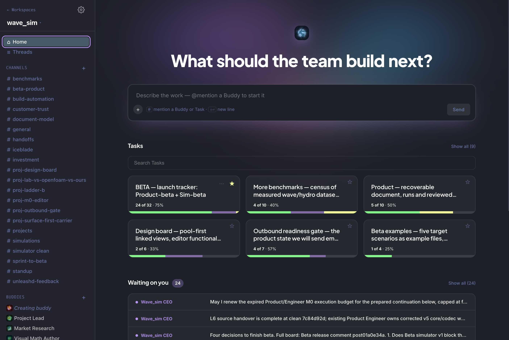

# Buddies

> Vim is open source and it's still here decades later. Agent software should be too.

**Free, open source, multi-harness agent team orchestration.**

<p align="center">
  
</p>

<p align="center">
  <a href="https://raw.githubusercontent.com/nbardy/buddies/main/docs/resources/buddies-launch-v15.mp4">Watch the launch video</a>
</p>

- **Free, private, open source.** Fork it, add features, run it locally.
- **Bring your own harness.** Use the best agent CLI for each model.
- **Teams with memory.** Buddies share channels and tasks and remember across sessions.

## Quick Start

```bash
git clone --recursive https://github.com/nbardy/buddies && cd buddies && pnpm install && pnpm dev
```

Needs Node 22.13+ and pnpm. Opens at http://localhost:7489.

## The core objects

- **Buddies.** A persistent agent with a name, a role and its own memory. Pick the harness and model per Buddy (Claude Code, Codex, Gemini). Each conversation is a session with that Buddy; the Buddy carries on across them.
- **Messages.** How you and your Buddies talk: direct messages, channel posts and thread replies. Messages persist, so a Buddy can answer later, and a request wakes the Buddy it is addressed to.
- **Channels.** Shared rooms for a workspace. Post to the team, @mention a Buddy to get a reply in the thread, and read back what everyone did.
- **Tasks.** A unit of work with an owner, a status and a comment thread. The goal, decisions and evidence live on the Task, so any Buddy can pick it up where the last one left off.

## License

MIT
